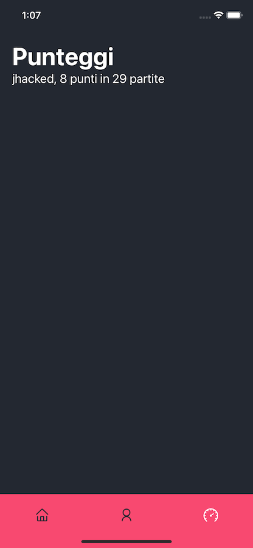

# MusixMatch job application workout

This application is made with Expo.

## To start the app

```
yarn start
```

## To start the tests

```
yarn test
```

## Requirements met

- [x] Quiz screen with N (3 in this example) cards
- [x] Profile screen with name and points of the last M games
- [x] Scoreboard that lists points and games of all the user that played
- [x] At each quiz the points are saved at last
- [x] The endpoints that has been used are: 

```
export const topSongs = "chart.tracks.get";
export const topArtists = "chart.artists.get";
export const songSnippet = "track.snippet.get";
```

## libs used
- redux
- redux-persist
- react-native-flash-messages for nice alerts
- react-navigation
- jest for testing
- axios for the api calls

## Things I didn't do for lack of time
- Test the fetchData function
- Avoid repeating multiple times the same artist in the buttons

## Screens



